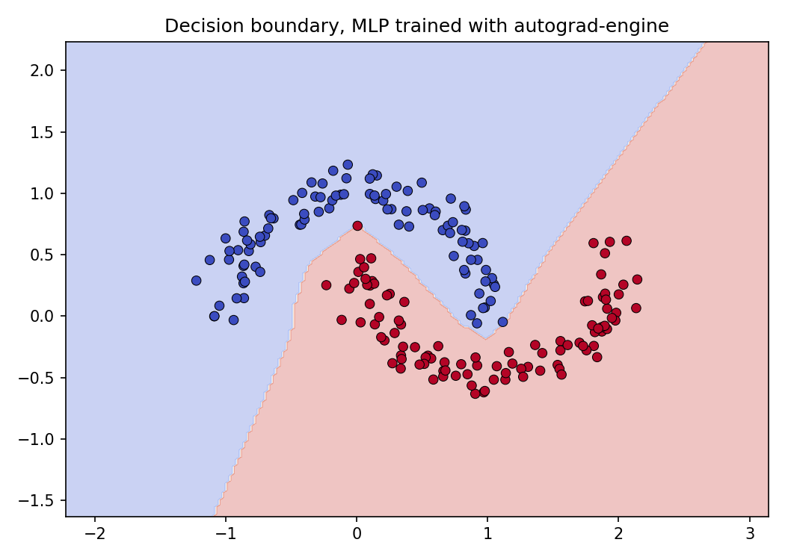

# autograd-engine

A from scratch automatic differentiation engine built on NumPy. Supports matrix operations, builds a dynamic computational graph, and computes gradients via reverse mode autodiff, the same algorithm behind PyTorch's autograd.

## Quick start

```python
import numpy as np
from autograd import Value

x = Value(np.array([[1.0], [2.0]]))
w = Value(np.array([[1.0, 2.0], [3.0, 4.0]]))

y = (w @ x).softmax()
z = y.sum()

z.eval()       # forward pass
z.backward()   # reverse-mode autodiff

print(w.grad)  # dL/dw
print(x.grad)  # dL/dx
```

## Training a neural network

`examples/train_moons.py` trains a 3-layer MLP on sklearn's `make_moons` dataset.

```python
class MLP:
    def __init__(self):
        self.w1 = Value(np.random.normal(size=(16, 2), scale=1 / 2))
        self.b1 = Value(np.zeros((16, 1)))
        self.w2 = Value(np.random.normal(size=(8, 16), scale=1 / 16))
        self.b2 = Value(np.zeros((8, 1)))
        self.w3 = Value(np.random.normal(size=(2, 8), scale=1 / 8))
        self.b3 = Value(np.zeros((2, 1)))

    def forward(self, x_val):
        x = Value(x_val)
        l1 = (self.w1 @ x + self.b1).relu()
        l2 = (self.w2 @ l1 + self.b2).relu()
        l3 = self.w3 @ l2 + self.b3
        return l3.softmax()

    def parameters(self):
        return [self.w1, self.b1, self.w2, self.b2, self.w3, self.b3]

model = MLP()

for xi, yi in zip(X, y):
    for p in model.parameters():
        p.grad = 0

    z = model.forward(xi.reshape(-1, 1))
    loss = y_true.cross_entropy(z)

    loss.eval()
    loss.backward()

    for p in model.parameters():
        p.value -= lr * p.grad
```

After 50 epochs the network correctly separates the two moons:



> Run `python examples/train_moons.py` to regenerate the plot.

## Architecture

Every computation is a node in a directed acyclic graph.

| Class                                           | Role                                                  |
| ----------------------------------------------- | ----------------------------------------------------- |
| `Value`                                         | Leaf node, holds a weight, bias, or input array       |
| `UnaryOp` / `BinaryOp`                          | Base classes for operations with one or two inputs    |
| concrete ops (`AddOp`, `MatMulOp`, `ReLUOp`, …) | Define `eval()` (forward) and `backdiff()` (backward) |

**Graph construction** happens implicitly through operator overloading. Writing `(w @ x + b).relu()` builds:

```
MatMulOp → AddOp → ReLUOp
```

**Forward pass**, call `.eval()` on the root node. Each op recursively evaluates its inputs and caches the result in `self.value`.

**Backward pass**, call `.backward()` on the root. `traverse_and_apply("backdiff")` walks the graph in BFS order, calling each node's `backdiff()` method, which accumulates `self.grad` into its inputs.

## Available operations

| Method                  | Op class         |
| ----------------------- | ---------------- |
| `a + b`, `a - b`        | `AddOp`, `NegOp` |
| `a * b`                 | `MulOp`          |
| `a @ b`                 | `MatMulOp`       |
| `.square()`             | `SquareOp`       |
| `.sum()`                | `SumOp`          |
| `.relu()`               | `ReLUOp`         |
| `.sigmoid()`            | `SigmoidOp`      |
| `.softmax()`            | `SoftmaxOp`      |
| `.cross_entropy(other)` | `CrossEntropyOp` |

## File structure

```
autograd-engine/
├── autograd/
│   ├── __init__.py
│   └── graph.py          # all nodes and ops (~200 lines)
├── examples/
│   ├── basic_ops.py      # forward + backward pass walkthrough
│   └── train_moons.py    # full training loop
├── decision_boundary.png
└── requirements.txt
```

## Install

```bash
pip install -r requirements.txt
python examples/basic_ops.py
python examples/train_moons.py
```
